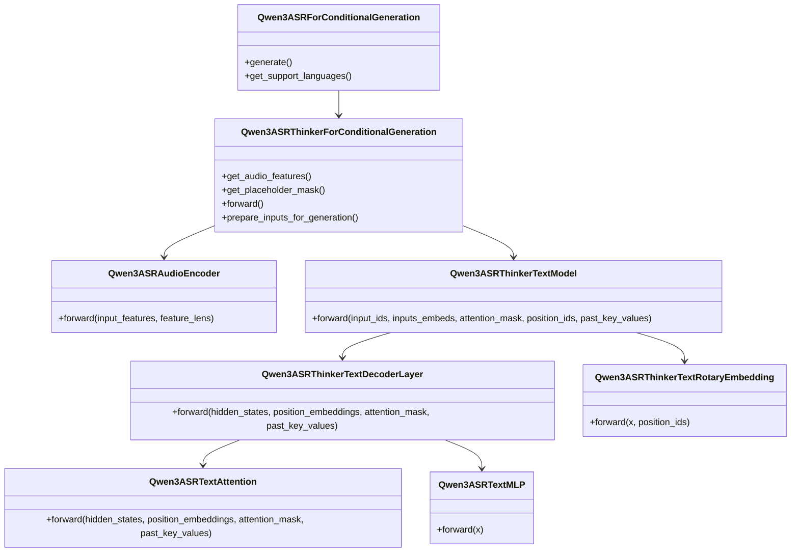
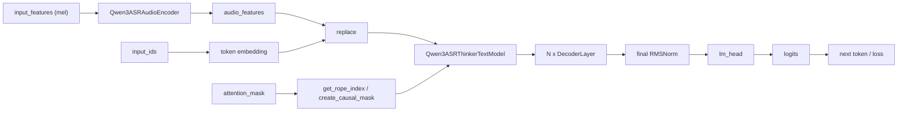

# Qwen3-ASR `modeling_qwen3_asr.py` 结构解读

这份说明对应文件：
`qwen_asr/core/transformers_backend/modeling_qwen3_asr.py`

目标是把这份代码按“整体结构 -> 关键模块 -> Transformer 前向过程 -> 为什么这样设计”的顺序讲清楚。

## 1. 先看整体

这不是一个“纯文本 Transformer”，而是一个多模态 ASR 模型，主链路可以概括成：

1. 音频先被转换为 mel 特征。
2. `Qwen3ASRAudioEncoder` 把 mel 特征编码成连续的音频 embedding。
3. 文本侧 prompt 里预先放了若干 `<audio>` 占位 token。
4. `Qwen3ASRThinkerForConditionalGeneration.forward()` 用音频 embedding 替换这些 `<audio>` token 的 embedding。
5. 替换后的整段 embedding 序列送入 `Qwen3ASRThinkerTextModel`。
6. 文本模型本质上是一个 causal Transformer decoder，自回归地产生转写结果。

所以它的本质不是“音频 encoder + text decoder 做 cross-attention”，而是：

- 音频先编码成一串连续向量
- 再直接塞进语言模型输入序列里
- 后续统一走 decoder-only Transformer

这个设计和很多 Qwen 多模态模型是一致的，好处是：

- 复用成熟的大语言模型 decoder 结构
- 生成接口天然兼容 Hugging Face `GenerationMixin`
- 不需要额外维护 encoder-decoder cross-attention 这套推理缓存逻辑

## 2. 代码里的主调用路径

真正参与 ASR 主推理的类关系如下。



注意：文件后半部分还有一组 `Qwen3ASRThinkerTextAttention / MLP / RMSNorm`，但当前这份文件里的主路径实际接的是前面这组：

- `Qwen3ASRThinkerTextDecoderLayer`
- `Qwen3ASRTextAttention`
- `Qwen3ASRTextMLP`

也就是说，理解主链时先盯住这组就够了。

## 3. 数据流转图



## 4. 音频编码器在做什么

对应类：`Qwen3ASRAudioEncoder`

### 4.1 输入

输入是 mel 频谱特征，单条样本大致可看成：

- shape: `(num_mel_bins, time)`

### 4.2 为什么先做 3 层卷积

它不是一上来就把整段音频扔进 Transformer，而是先做：

- `conv2d1`
- `conv2d2`
- `conv2d3`

作用有两个：

1. 降采样时间长度，降低后续 attention 的计算量。
2. 在局部时间窗口内先抽取低层声学模式。

如果不先降采样，长音频直接进 Transformer，显存和计算都会非常重。

### 4.3 为什么先切 chunk 再卷积

在 `forward()` 里你会看到按窗口切块：

- `chunk_num`
- `chunk_lengths`
- `input_features.T.split(...)`

这是为了控制长音频的内存占用。做法是：

1. 先把长音频切成多个时间块。
2. 把这些块 pad 成一个 batch。
3. 跑卷积。
4. 再把 pad 的位置去掉，拼成有效帧序列。

### 4.4 为什么音频侧也有 Transformer

卷积后，特征已经是更短、更抽象的表示，但还缺少长程上下文建模，所以接了一串 `Qwen3ASRAudioEncoderLayer`。

每层结构是标准 encoder block：

1. `LayerNorm`
2. Self-Attention
3. Residual
4. `LayerNorm`
5. FFN
6. Residual

和 NLP 里常见 Transformer encoder 基本一致。

### 4.5 `cu_seqlens` 是干什么的

音频经过切块后，多个 chunk 的有效帧被打包成了一条长序列。

但 attention 不能让不同 chunk 互相随便看，否则会把本不相邻的片段混在一起。

所以这里维护了 `cu_seqlens`，即 cumulative sequence lengths。它告诉 Flash Attention：

- 第 1 个 chunk 的 token 范围
- 第 2 个 chunk 的 token 范围
- 第 3 个 chunk 的 token 范围

这样 attention 只在 chunk 内部计算。

## 5. 文本侧 Transformer 在做什么

对应类：

- `Qwen3ASRThinkerTextModel`
- `Qwen3ASRThinkerTextDecoderLayer`
- `Qwen3ASRTextAttention`
- `Qwen3ASRTextMLP`

这个部分本质上是 decoder-only Transformer，也就是 GPT/LLaMA/Qwen 这一路的结构。

### 5.1 每层 decoder block 的结构

`Qwen3ASRThinkerTextDecoderLayer.forward()` 可以抽象成：

```python
x = x + SelfAttention(RMSNorm(x))
x = x + MLP(RMSNorm(x))
```

这叫 pre-norm 结构。

优点：

- 深层网络更稳定
- 梯度传播更容易
- 大模型里已经是主流设计

### 5.2 Self-Attention 到底做了什么

看 `Qwen3ASRTextAttention.forward()`。

它的流程是：

1. 输入 `hidden_states`，shape 近似是 `(batch, seq_len, hidden_size)`。
2. 分别线性投影得到 `Q / K / V`。
3. reshape 成多头形式。
4. 给 `Q / K` 加上 RoPE 位置编码。
5. 如果是生成阶段并且有 cache，就把旧的 `K / V` 拼回来。
6. 计算 attention：
   - `softmax(QK^T / sqrt(d))`
   - 再乘 `V`
7. 多头拼回去，再过 `o_proj`。

### 5.3 为什么只给 Q 和 K 加位置编码

RoPE 作用在 `Q / K` 上，是因为 attention 分数来自 `Q` 和 `K` 的内积。

只要让 `Q` 和 `K` 带上位置信息，attention 分数就自然能区分：

- 谁在前
- 谁在后
- 相对距离大概是多少

`V` 不参与位置旋转，是常见做法。

### 5.4 `repeat_kv()` 在干什么

这是 grouped-query attention 的典型逻辑。

意思是：

- query 头数很多
- key/value 头数可以更少

这样能减少 KV cache 的体积，降低生成时显存压力。

但做真正的 attention 矩阵乘法时，Q 的 head 数和 K/V 的 head 数要能对齐，所以要把 K/V 复制展开。

### 5.5 为什么要 `past_key_values`

如果做自回归生成，第 100 个 token 不需要重新计算前 99 个 token 的 K/V。

所以每次只算当前新 token 的 K/V，然后拼到缓存里：

- 更快
- 更省算力

这就是 decoder 推理阶段常见的 KV cache。

## 6. RoPE / position_ids 为什么这么绕

这部分对应：

- `get_rope_index()`
- `Qwen3ASRThinkerTextRotaryEmbedding.forward()`
- `prepare_inputs_for_generation()`

### 6.1 `attention_mask.cumsum() - 1`

`get_rope_index()` 里最关键的是：

```python
position_ids = attention_mask.float().cumsum(-1) - 1
```

意思是：

- 只对有效 token 编连续位置
- padding 不参与真实位置计数

这在多模态和带 padding 的 batch 中都很常见。

### 6.2 为什么 position ids 扩成 3 份

你会看到 shape 是：

- `(3, batch, seq_len)`

这是因为作者沿用了 Qwen 家族更一般化的 MRoPE 接口。它允许时间/高度/宽度这类多轴位置编码统一处理。

对这份 ASR 路径来说，通常可以把它理解成：

- 保留了一个更通用的位置编码壳子
- 但实际文本序列大多还是 1D 的因果序列

### 6.3 为什么生成时还要记 `rope_deltas`

第一轮前向会根据整段 prompt 算出一套位置偏移。

后续增量解码时，不能从 0 重新编号，否则和缓存中的历史 token 位置对不上。

所以要记住这份偏移量：

- 首轮完整计算
- 后续只给新增 token 补位置

## 7. 多模态融合为什么是“替换 embedding”

`Qwen3ASRThinkerForConditionalGeneration.forward()` 里最关键的设计是：

```python
audio_mask = self.get_placeholder_mask(input_ids, inputs_embeds=inputs_embeds)
inputs_embeds = inputs_embeds.masked_scatter(audio_mask, audio_features)
```

这说明：

- prompt 中的 `<audio>` token 只是占位符
- 真正送进 decoder 的不是这些 token 的离散 embedding
- 而是音频编码器输出的连续向量

这样做的优点：

1. 文本模型不需要单独写 cross-attention 分支。
2. 语言模型看到的是一个统一 embedding 序列。
3. 训练和推理接口都更接近普通 decoder-only LLM。

## 8. 为什么选择 decoder-only，而不是 encoder-decoder ASR

这是理解设计思路的关键。

更传统的 ASR 往往是：

- 音频 encoder
- 文本 decoder
- decoder 对 encoder 做 cross-attention

这份实现更接近多模态 LLM：

- 音频先变成 token-like embedding
- 再直接并入 LLM 输入序列

这么设计通常是因为：

1. 更容易复用已有大语言模型权重和生成框架。
2. KV cache 逻辑更统一。
3. 多模态扩展更简单，图像/音频/视频都能走“先编码成 embedding，再插入序列”这一路。

代价是：

1. 占位 token 数量和音频 embedding 数量必须严格对齐。
2. 对 prompt 构造要求更强。
3. 位置编码和多模态对齐逻辑会更复杂。

## 9. 如何阅读 `forward()`，建议顺序

如果你之前 Transformer 接触不多，建议按下面顺序读：

1. `Qwen3ASRForConditionalGeneration.generate()`
   先看最外层入口。
2. `Qwen3ASRThinkerForConditionalGeneration.forward()`
   看音频 embedding 怎样注入文本序列。
3. `Qwen3ASRThinkerTextModel.forward()`
   看 decoder 怎样准备 causal mask、RoPE、cache。
4. `Qwen3ASRThinkerTextDecoderLayer.forward()`
   看标准 Transformer block。
5. `Qwen3ASRTextAttention.forward()`
   看 Q/K/V、RoPE、cache、attention 真正怎么走。
6. `Qwen3ASRAudioEncoder.forward()`
   最后回头看音频是怎样被编码成可替换 embedding 的。

这样比从文件头到尾硬读更容易建立“主链”。

## 10. 有没有现成 API 直接导出结构图 / 数据流图

结论先说：

- Hugging Face `transformers` 本身没有一个稳定、通用、对这种自定义多模态模型“一键导出结构图和数据流图”的官方 API。

你可以考虑下面几类工具：

### 10.1 `torch.fx`

适合：

- 想得到可追踪的计算图
- 想看某些子模块之间的调用关系

限制：

- 对动态控制流、cache、条件分支、自定义 attention backend 不一定稳定
- 这份模型里有 generation cache、多种 attention backend、动态 position ids，直接全模型 trace 往往不够干净

### 10.2 `torchview` / `torchinfo`

适合：

- 看模块层级
- 看 tensor shape

限制：

- 更像“层级结构图”或“summary”
- 不等于真正的数据流语义图

### 10.3 `torchviz`

适合：

- 可视化某一次具体前向产生的 autograd graph

限制：

- 图通常非常大
- 对理解高层模块设计帮助有限

### 10.4 最实用的方式

对这类模型，最实用的一般还是两步：

1. 人工画“模块级数据流图”
2. 用 `torchinfo` 或 `torchview` 辅助看 shape 和层级

也就是：

- 图靠人工抽象
- 细节靠 runtime summary 验证

## 11. 这份文件里最该抓住的几个关键词

如果你只记住几个关键词，建议记这几个：

- `audio_tower`: 音频编码器
- `masked_scatter`: 把音频 embedding 塞进 `<audio>` 占位
- `create_causal_mask`: decoder 因果 mask
- `past_key_values`: 生成时 KV cache
- `apply_rotary_pos_emb`: 给 Q/K 加 RoPE
- `repeat_kv`: grouped-query attention
- `RMSNorm + residual`: 现代 decoder block 常见骨架

## 12. 一句话总结

这份 `modeling_qwen3_asr.py` 的核心思想是：

“先把音频编码成一串可替代 token embedding 的连续向量，再交给一个标准的 decoder-only Transformer 按语言模型方式自回归生成文本。”

理解了这句话，文件里大部分设计都会顺下来。
